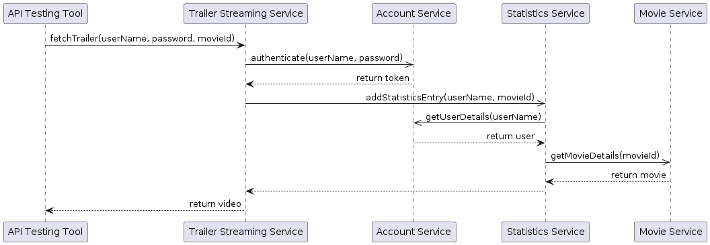
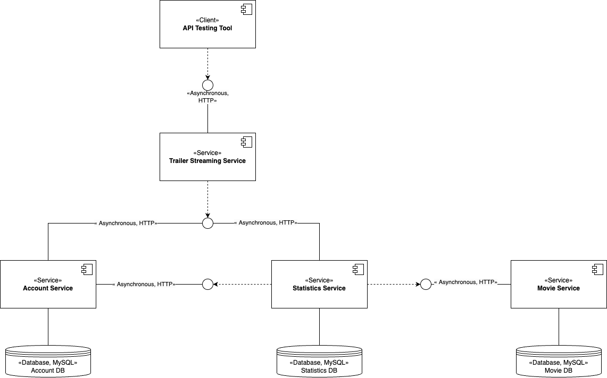
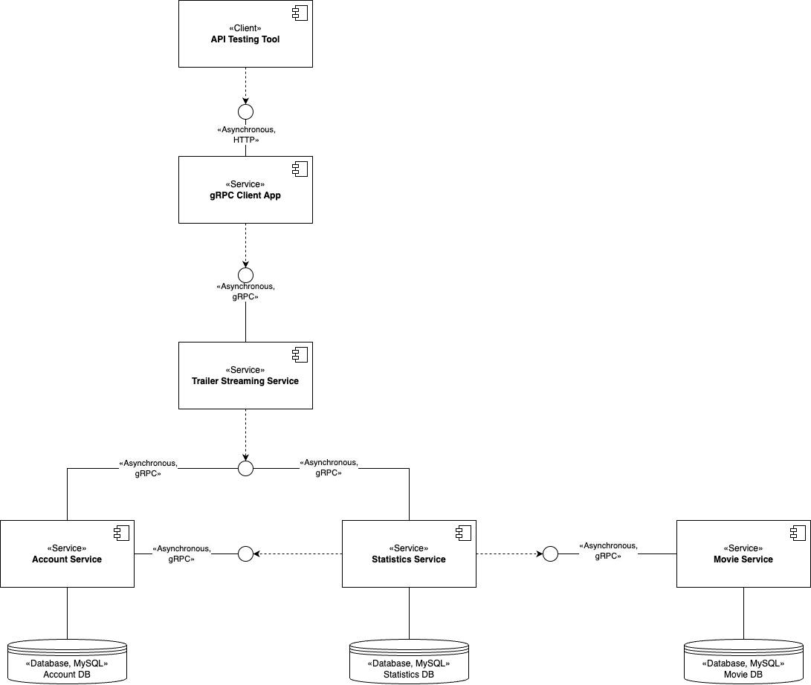
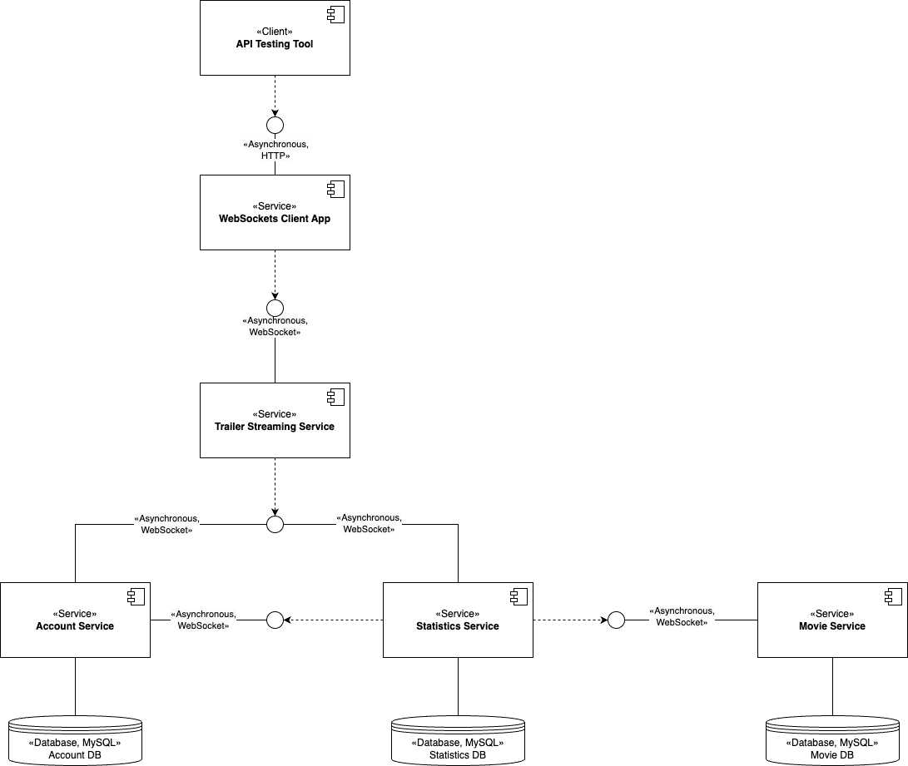
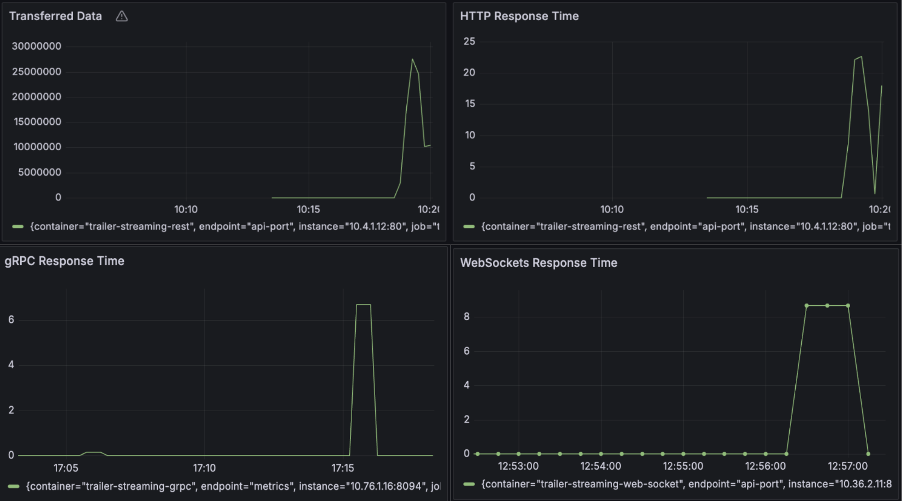

# Comparative Study of Communication Technologies Between Microservices

## Project Overview and Objectives

The goal of this project is to conduct a performance comparison between the selected communication technologies within microservice architectures. This involves identifying decision criteria for technology selection, implementing a practical example, and evaluating the performance of each technology. Additionally, the project aims to understand the underlying reasons for the observed performance differences.

The communication technologies selected for comparison are HTTP, gRPC, and WebSockets.

The practical example is a system for streaming videos comprising 4 microservices:
- **Trailer Streaming Service**: Streams movie trailers upon authorized request
- **Movie Service**: Handles movie data management
- **Account Service**: Manages user account registration and authentication
- **Statistics Service**: Collects data on movies and users

I developed 3 versions of the application with the selected communication technologies. The inter-service communication between the microservices is the same across all versions. The developed test application issues a configurable number of concurrent requests to the entry point of each version. 

One request involves the execution of the use case depicted below.

## HTTP Implementation

## gRPC Implementation

## WebSocket Implementation

## Results

To measure the performance of the microservices, the following steps were taken:
- Deployed the microservices and the test application in a Kubernetes cluster on GCP.
- Issued the same set of 100 concurrent requests to each version.
- Collected data transfer metrics (in bytes) and response time metrics (in seconds) using Prometheus.
- Visualized the results using Grafana.  

The evaluation of the three communication protocols highlighted notable differences in their performance. Below are the key findings for each protocol:

- **HTTP**
  - Had the worst performance among the three.
  - Not optimized for the efficient transfer of large files.
  - Mostly suited for simpler systems.
  - Offers development simplicity as an advantage.
  
- **gRPC**
  - Outperformed WebSockets and HTTP due to lightweight payloads and efficient serialization.
  - Utilizes Protocol Buffers, which serialize data in a binary format, resulting in lightweight payloads compared to HTTP.
  - Ideal for video streaming systems and applications where high performance is a priority.
  - Disadvantages include limited support by browsers and a steeper learning curve.
  
- **WebSockets**
  - Performed better than HTTP, but not as well as gRPC.
  - The inter-service communication impacts its performance.
  - Very suitable for the Trailer Streaming Service due to its persistent connections.
  - Not an ideal choice for simpler services.

### Conclusion

The choice of the communication protocol for each microservice should be considered individually based on its specific needs and functions, taking into account the project needs such as the ease of development vs high performance.

The potentially most suitable communication technologies for the microservices in our practical example could have been the following:
- **Trailer Streaming Service**: WebSockets for real-time streaming
- **Account Service**: HTTP for simplicity
- **Statistics Service & Movie Service**: GraphQL for efficient data retrieval

## Testing Instructions

To deploy the services in a Kubernetes cluster the following bash scripts located in the `Scripts` folder should be executed:
- `start-http.sh`
- `start-grpc.sh`
- `start-web-sockets.sh`

For deploying Prometheus and Grafana use the following scripts:
- `start-metrics-http.sh`
- `start-metrics-grpc.sh`
- `start-metrics-web-sockets.sh`

To issue requests to the services, use the following URL format:
- `http://.../test-app/test?version=http&numberOfRequests=100`
- `http://.../test-app/test?version=grpc&numberOfRequests=100`
- `http://.../test-app/test?version=websockets&numberOfRequests=100`

The Grafana dashboards for each version can be found in the `Grafana` folder.